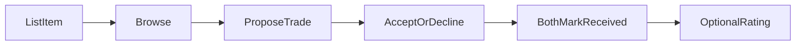
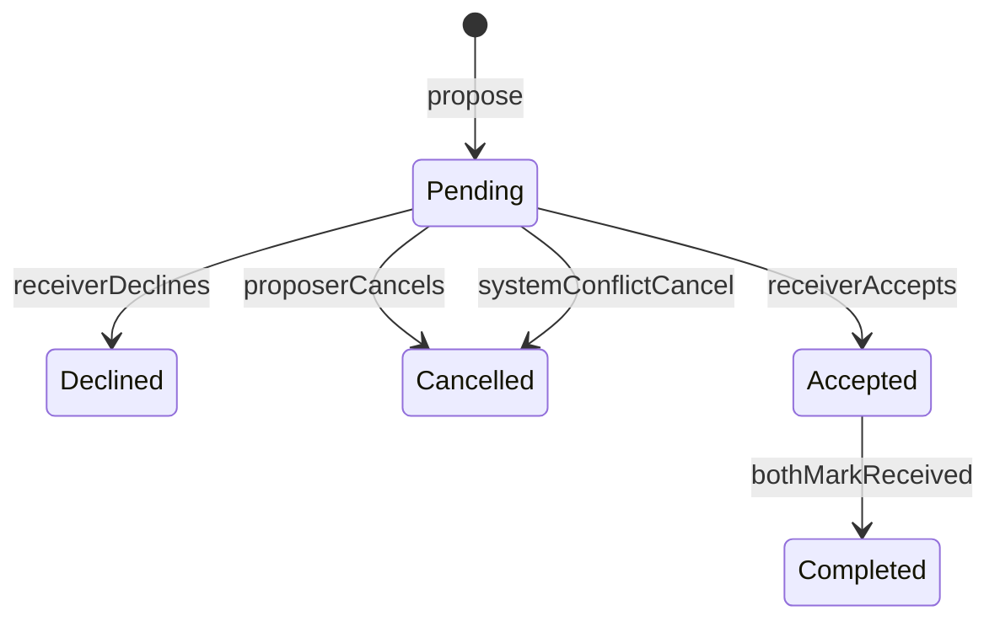

Status: Approved

# Easy Exchange Product Plan

## Problem statement and target users

Casual collectors struggle to find fair **item-for-item** swaps. Forums and social posts are noisy, hard to track, and easy to flake on. Easy Exchange is a small web app where collectors list collectibles, browse others’ listings, propose multi-for-one trades, and complete exchanges with mutual “received” confirmation—**no money**, no chat, no mobile app.

**Primary users:** casual collectors (trading cards, coins, action figures, comics) who want a clear listing → offer → accept → confirm flow, plus a reliable class demo via seeded accounts.

---

## MVP features (Must / Should / Won't)

### Must
- Public email/password sign-up and sign-in; display name; optional city
- Listings: title, category (Trading Cards | Coins | Action Figures | Comics), condition (Mint → Fair), description, 1–3 photos; optional estimated value (fairness hint only) and “looking for” text
- Browse/filter listings (at least by category; exclude own active listings or mark them clearly)
- Propose trade: 1–3 of proposer’s available items for **1** of receiver’s items
- Receiver accept/decline; proposer cancel while pending
- On accept: involved listings → `InTrade`; other pending offers touching those items auto-cancelled
- After accept: each party marks “item received”; trade completes when both confirm (listings → `Traded`)
- Post-complete: optional 1–5 rating + short comment per party
- Seeded demo users, listings, and sample trade states for demos
- Categories extensible in the data model (seeded enum/table, not hard-coded forever)
- Photos: local filesystem, JPEG/PNG only, max 5 MB each (1–3 per listing)

### Should
- Full wishlist (structured wants beyond free-text “looking for”)
- Richer browse (condition filter, search by title)
- Profile page showing ratings/history summary

### Won't (this MVP)
- Payments / shipping fees / escrow
- Real-time chat or in-app messaging
- In-app counter-offers
- Shipping tracking
- Report/block, ID verification beyond email
- Native mobile app
- Multi-item asks (receiver side always exactly one item)
- Cancelling or disputing a trade after it is Accepted
- Password reset (demo accounts are sufficient for class)

---

## Core user flows

1. **List an item** — Sign in → create listing (required fields + 1–3 photos) → listing is available for offers.
2. **Browse** — Open catalog → filter by category (and basic availability) → open listing detail (condition, photos, looking-for, value hint, owner display name/city).
3. **Propose a trade** — On another user’s listing (not own) → pick 1–3 of own `Available` items → submit offer (status: Pending). At most one Pending offer per proposer per target listing.
4. **Respond to an offer** — Receiver sees pending offers → Accept or Decline. Proposer may Cancel while Pending. Accept sets involved listings to `InTrade` and auto-cancels conflicting pending offers. Declined/cancelled offers remain in offer history.
5. **Complete a trade** — Parties arrange shipping/meetup offline → each marks “item received” → when both confirmed, trade is Completed, listings become `Traded` → each may leave rating/comment. No cancel/dispute after Accept.

---

## Key domain concepts and rules

| Concept | Rule |
|--------|------|
| **User** | Email/password, display name, optional city; no password reset in MVP |
| **Category** | Seeded fixed list; schema allows adding categories later |
| **Condition** | Mint, Near Mint, Excellent, Good, Fair + optional notes |
| **Listing status** | `Available` → `InTrade` (accepted trade) → `Traded` (completed); never hard-deleted when traded |
| **Photos** | Local filesystem; JPEG/PNG only; max 5 MB each; 1–3 per listing |
| **TradeOffer** | Proposer → Receiver; 1–3 of proposer’s listings for exactly 1 target listing; cannot propose on own listing |
| **Pending uniqueness** | At most one `Pending` offer per proposer per target listing |
| **Offer statuses** | `Pending` → `Accepted` \| `Declined` \| `Cancelled` (by proposer or system); declined/cancelled stay in offer history |
| **Edit/delete lock** | A listing in any `Pending` offer or in an `Accepted` trade cannot be edited or deleted |
| **Trade (post-accept)** | Tracks each party’s `received` flag; `Completed` when both true; no cancel/dispute after Accept |
| **Conflict rule** | On accept: involved listings → `InTrade`; any other `Pending` offer that includes any of those listings → `Cancelled` |
| **Completion** | On complete: involved listings → `Traded` (kept, not hard-deleted) |
| **Rating** | Only after `Completed`; one rating per party per trade (1–5 + short comment) |

**Trade offer lifecycle (detail)**

On **Accepted**: listings → `InTrade`; cancel conflicting pending offers. On **Completed**: listings → `Traded`. No reopen; no post-accept cancel/dispute.

---

## Tech stack (chosen)

**Chosen:** Option A — Next.js (App Router) + TypeScript + Prisma + SQLite + Auth.js (credentials), photos on local filesystem.

**Why:** Single codebase and shared types suit a one-week solo build; Prisma + SQLite keeps domain rules and seeding simple for demos.

**Not chosen:** Option B (Django ± React) — stronger admin/forms story, but less aligned with a single TypeScript codebase for this course week.

---

## Risks and decided constraints

**Risks**
- Photo upload still eats time even with local filesystem — enforce JPEG/PNG and 5 MB limits early
- Offer conflict cancellation is easy to get wrong — needs clear acceptance tests in a later spec
- Scope creep (wishlist, chat-like notes, counters) — enforce Must-only for week one
- Trust offline: no escrow; ratings only after complete — accepted product risk
- An accepted trade can stall if one party never confirms (no cancel/dispute after Accept)

**Decided (formerly open questions)**
- Photos: local filesystem, JPEG/PNG, max 5 MB each
- Declined and cancelled offers remain visible in each user’s offer history
- One Pending offer per proposer per target listing
- Traded listings kept with status `Traded` (never hard-deleted)
- Password reset: Won't for MVP; demo accounts suffice
